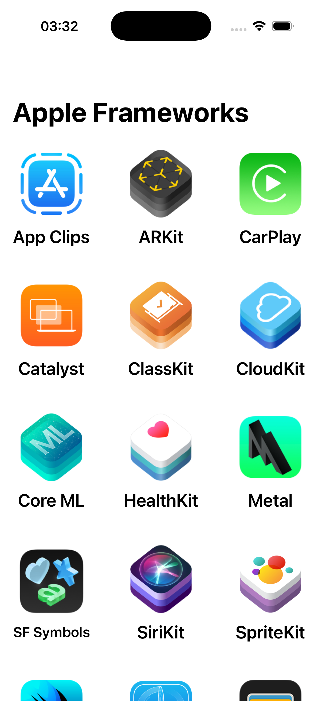
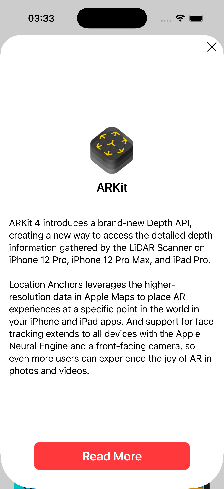
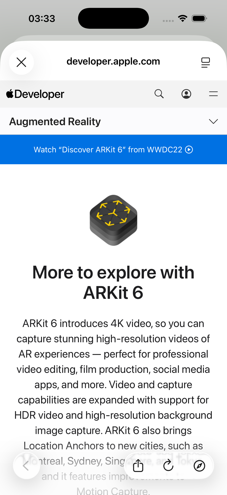

# Apple Frameworks

A SwiftUI-based iOS app that showcases Apple's frameworks with detailed information and quick access to official documentation.

## Overview

Apple Frameworks is a grid-based application that displays all major Apple development frameworks. Users can browse through frameworks in an interactive grid, tap to view detailed information, and access official Apple documentation through an in-app Safari browser.

## Screenshots
|  |  |  |
|---|---|---|
  

## Features

- **Framework Grid Display**: Browse 16+ Apple frameworks in a responsive 3-column grid layout
- **Detailed Framework Information**: View comprehensive descriptions of each framework
- **In-App Documentation**: Access official Apple developer documentation via Safari
- **Smooth Navigation**: Sheet-based navigation for detail views with dismiss functionality
- **Dynamic UI**: Responsive design that adapts to different screen sizes and orientations

## Project Structure

```
Apple-Frameworks/
├── Apple_FrameworksApp.swift          # App entry point
├── Model/
│   └── Framework.swift                # Framework data model and mock data
├── Screens/
│   ├── FrameworkGridView/
│   │   ├── FrameworkGridView.swift    # Main grid display screen
│   │   └── DetailFrameworkViewModel.swift # Grid view logic
│   └── DetailFrameworkView/
│       └── DetailFrameworkView.swift  # Framework detail screen
├── Views/
│   ├── Buttons/
│   │   ├── AFButton.swift             # Primary action button
│   │   └── XDismissButtonView.swift   # Dismiss button component
│   └── Views/
│       └── FrameworkTitleView.swift   # Framework title and icon display
├── UIKit-Screens/
│   └── SafariView.swift               # Safari browser wrapper
└── Assets.xcassets/                   # App icons and framework images
```

## Key Components

### Models
- **[Framework.swift](Apple-Frameworks/Model/Framework.swift)**: Defines the `Framework` struct and contains mock data for 16 Apple frameworks

### View Models
- **[DetailFrameworkViewModel.swift](Apple-Frameworks/Screens/DetailFrameworkView/DetailFrameworkViewModel.swift)**: Manages grid state, including selected framework and sheet presentation

### Views
- **[FrameworkGridView.swift](Apple-Frameworks/Screens/FrameworkGridView/FrameworkGridView.swift)**: Main screen displaying frameworks in a 3-column grid
- **[DetailFrameworkView.swift](Apple-Frameworks/Screens/DetailFrameworkView/DetailFrameworkView.swift)**: Detailed view for individual frameworks with description and documentation link
- **[FrameworkTitleView.swift](Apple-Frameworks/Views/Views/FrameworkTitleView.swift)**: Reusable component displaying framework icon and name
- **[AFButton.swift](Apple-Frameworks/Views/Buttons/AFButton.swift)**: Custom styled button for primary actions
- **[XDismissButtonView.swift](Apple-Frameworks/Views/Buttons/XDismissButtonView.swift)**: Reusable dismiss button component
- **[SafariView.swift](Apple-Frameworks/UIKit-Screens/SafariView.swift)**: UIViewControllerRepresentable wrapper for SFSafariViewController

## Frameworks Included

The app includes detailed information about:
- App Clips
- ARKit
- CarPlay
- Catalyst
- ClassKit
- CloudKit
- Core ML
- HealthKit
- Metal
- SF Symbols
- SiriKit
- SpriteKit
- SwiftUI
- Test Flight
- Wallet
- WidgetKit

## Requirements

- iOS 26.0+
- Xcode 16.0+
- Swift 5.0+

## Installation

1. Clone the repository:
   ```bash
   git clone https://github.com/leesangoroh/Apple-Frameworks.git
   ```

2. Open the project in Xcode:
   ```bash
   open Apple-Frameworks.xcodeproj
   ```

3. Select your target device or simulator

4. Build and run (⌘R)

## Usage

1. **Browse Frameworks**: Launch the app to see the framework grid
2. **View Details**: Tap any framework to open the detail sheet
3. **Read Documentation**: Tap "Read More" to access the official Apple documentation in Safari
4. **Dismiss**: Use the X button or swipe down to close the detail view

## Architecture

The app follows MVVM (Model-View-ViewModel) architecture:
- **Models**: Define data structures and mock data
- **ViewModels**: Handle state management and business logic
- **Views**: Present the UI and respond to user interactions

## Styling

- Primary button color: Red
- Supports Dark Mode
- Uses system fonts for accessibility
- Implements Dynamic Type for text scaling

## Future Enhancements

- Persist favorite frameworks
- Search and filter functionality
- Framework comparison view
- Offline documentation caching
- Dark mode color customization

## License

This project is open source and available under the MIT License.